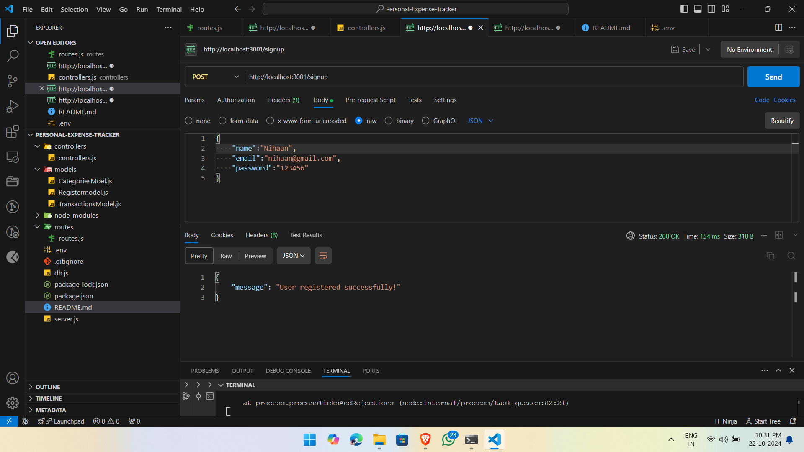
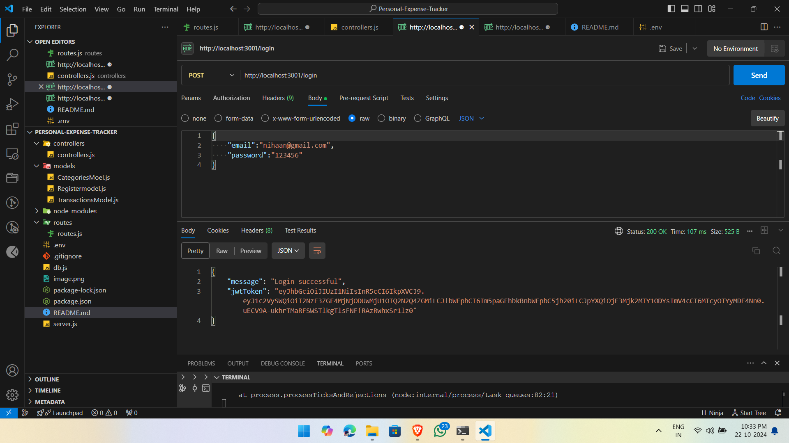
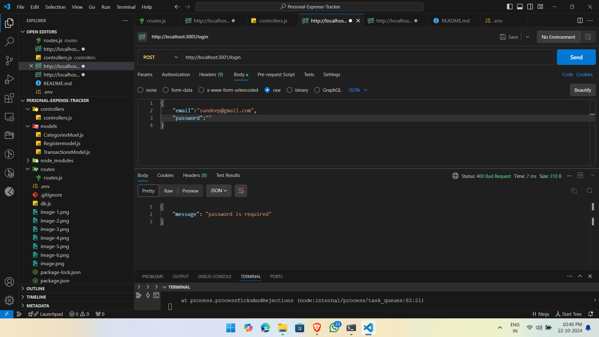
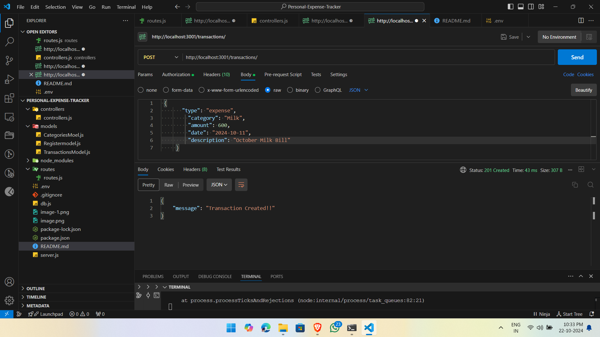
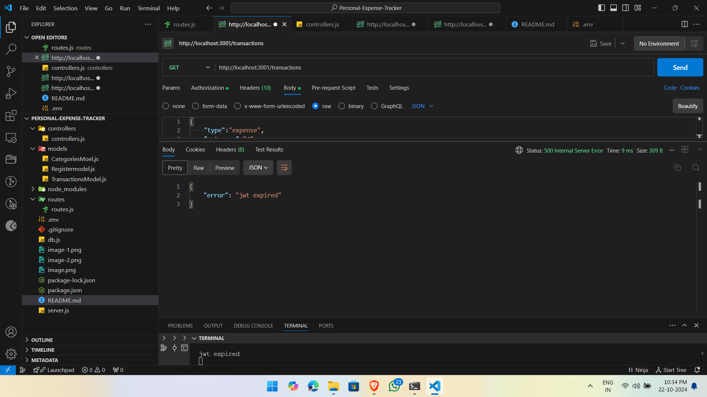
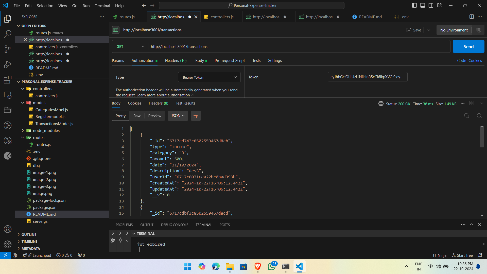
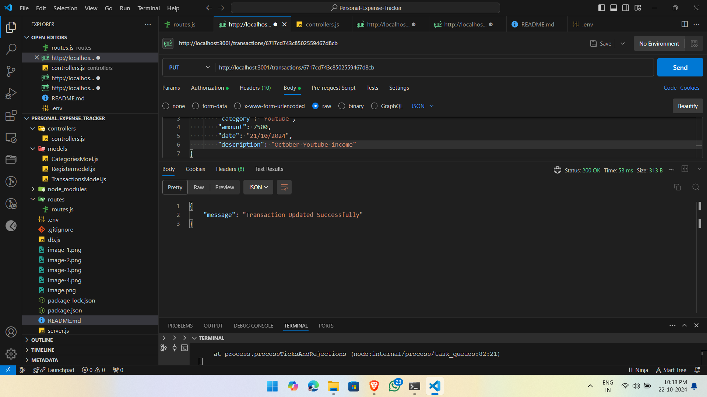
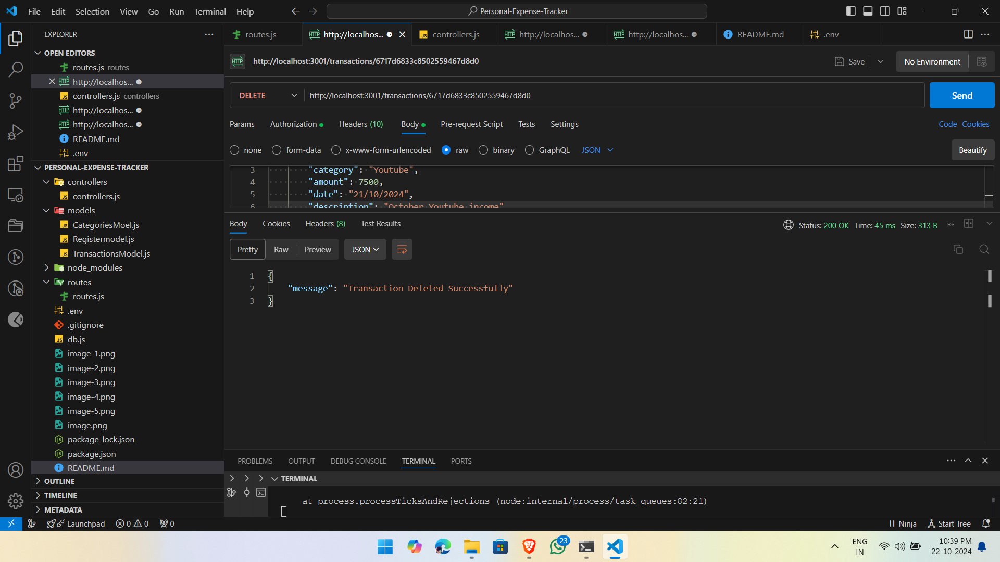
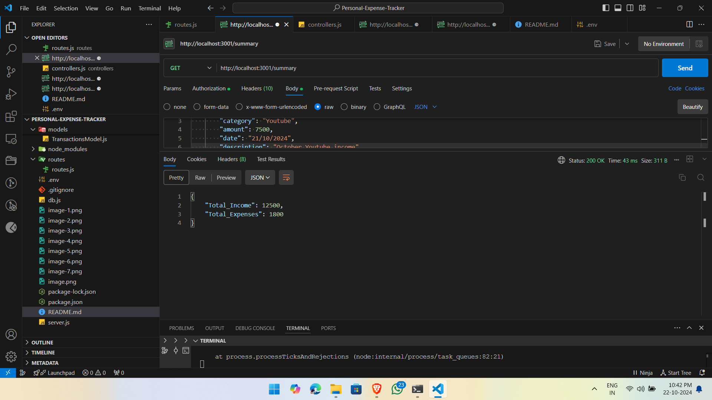

# Transaction Management API

This is a Node.js and MongoDB-based REST API for managing user transactions. The API allows users to sign up, log in, and create, update, view, and delete financial transactions (categorized as "income" or "expenses"). It also provides a summary of total income and expenses for authenticated users.

## Table of Contents
- [Setup and Run Instructions](#setup-and-run-instructions)
- [API Documentation](#api-documentation)
  - [Authentication](#authentication)
  - [Transactions](#transactions)
  - [Summary](#summary)
- [Postman Screenshots](#postman-screenshots)
  
---

## Setup and Run Instructions

### Prerequisites
- Node.js (v12+)
- MongoDB (running locally or on a cloud service like MongoDB Atlas)
- Postman (for testing API endpoints)

### Installation Steps
1. Clone the repository:
    ```bash
    git clone https://github.com/Sandeep-1405/Personal-Expense-Tracker.git
    cd Personal-Expense-Tracker
    ```

2. Install the dependencies:
    ```bash
    npm install
    ```

3. Set up environment variables:
    Create a `.env` file in the root directory with the following environment variables:
    ```plaintext
    PORT=5000
    MONGO_URI=your-mongodb-connection-string
    JWT_SECRET=your-secret-key
    ```

4. Start the server:
    ```bash
    npm start
    ```
   The server should now be running on `http://localhost:5000`.

### Running Tests
To manually test the API, you can use Postman or any other API client. See the API documentation below for available endpoints and how to interact with them.

---

## API Documentation

### Authentication

#### 1. **User Registration**
   - **Endpoint**: `POST /signup`
   - **Description**: Register a new user.
   - **Request Body**:
     ```json
     {
       "name": "Sandeep",
       "email": "sandeep@gmail.com",
       "password": "password123"
     }
     ```
   - **Response**:
     - `200 OK`: User registered successfully.
     - `400 Bad Request`: Email already registered or missing required fields.
   - **Example Response**:
     ```json
     {
       "message": "User registered successfully!"
     }
     ```

#### 2. **User Login**
   - **Endpoint**: `POST /login`
   - **Description**: Log in an existing user and get a JWT token.
   - **Request Body**:
     ```json
     {
       "email": "sandeep@gmail.com",
       "password": "password123"
     }
     ```
   - **Response**:
     - `200 OK`: Login successful, returns a JWT token.
     - `401 Unauthorized`: Invalid email or password.
   - **Example Response**:
     ```json
     {
       "message": "Login successful",
       "jwtToken": "eyJhbGciOiJIUzI1NiIsInR5cCI6IkpXVCJ9..."
     }
     ```

---

### Transactions

> **Note**: All transaction routes require user authentication. Include the `Authorization: Bearer <JWT_TOKEN>` header with your requests.

#### 3. **Create a Transaction**
   - **Endpoint**: `POST /transactions`
   - **Description**: Create a new transaction for the authenticated user.
   - **Request Body**:
     ```json
     {
       "type": "income",
       "category": "Salary",
       "amount": 5000,
       "date": "2024-10-10",
       "description": "October salary"
     }
     ```
   - **Response**:
     - `201 Created`: Transaction created successfully.
     - `400 Bad Request`: Missing or invalid fields.
   - **Example Response**:
     ```json
     {
       "message": "Transaction Created!!"
     }
     ```

#### 4. **Get All Transactions**
   - **Endpoint**: `GET /transactions`
   - **Description**: Retrieve all transactions for the authenticated user.
   - **Response**:
     - `200 OK`: Returns a list of transactions.
     - `404 Not Found`: No transactions found for the user.
   - **Example Response**:
     ```json
     [
       {
         "_id": "6531e8f05660f546ef345672",
         "type": "income",
         "category": "Salary",
         "amount": 5000,
         "date": "2024-10-10",
         "description": "October salary",
         "userId": "6521d7e81203fa63e80e7c9b"
       },
       {
         "_id": "6531e8f05660f546ef345673",
         "type": "expense",
         "category": "Rent",
         "amount": 1200,
         "date": "2024-10-11",
         "description": "October rent",
         "userId": "6521d7e81203fa63e80e7c9b"
       }
     ]
     ```

#### 5. **Get Transaction by ID**
   - **Endpoint**: `GET /transactions/:id`
   - **Description**: Retrieve a specific transaction by ID.
   - **Response**:
     - `200 OK`: Returns the transaction details.
     - `404 Not Found`: Transaction not found.
   - **Example Response**:
     ```json
     {
       "_id": "6531e8f05660f546ef345672",
       "type": "income",
       "category": "Salary",
       "amount": 5000,
       "date": "2024-10-10",
       "description": "October salary",
       "userId": "6521d7e81203fa63e80e7c9b"
     }
     ```

#### 6. **Update a Transaction**
   - **Endpoint**: `PUT /transactions/:id`
   - **Description**: Update an existing transaction.
   - **Request Body**: Any of the transaction fields (`type`, `category`, `amount`, `date`, `description`).
   - **Response**:
     - `200 OK`: Transaction updated successfully.
     - `404 Not Found`: Transaction not found or unauthorized.
   - **Example Response**:
     ```json
     {
       "message": "Transaction Updated Successfully"
     }
     ```

#### 7. **Delete a Transaction**
   - **Endpoint**: `DELETE /transactions/:id`
   - **Description**: Delete a transaction.
   - **Response**:
     - `200 OK`: Transaction deleted successfully.
     - `404 Not Found`: Transaction not found or unauthorized.
   - **Example Response**:
     ```json
     {
       "message": "Transaction Deleted Successfully"
     }
     ```

---

### Summary

#### 8. **Get Transaction Summary**
   - **Endpoint**: `GET /summary`
   - **Description**: Get a summary of total income and expenses for the authenticated user.
   - **Response**:
     - `200 OK`: Returns the summary of total income and expenses.
   - **Example Response**:
     ```json
     {
       "Total_Income": 5000,
       "Total_Expenses": 1200
     }
     ```

---

## Postman Screenshots

Including screenshots of Postman demonstrating each of the API calls.

1. **Signup Request**:
   

2. **Login Request**:
   
    

3. **Create Transaction Request**:
   
   

4. **Get All Transactions Request**:
   

5. **Update Transaction Request**:
   

6. **Delete Transaction Request**:
   

7. **Summary Request**:
   

---
